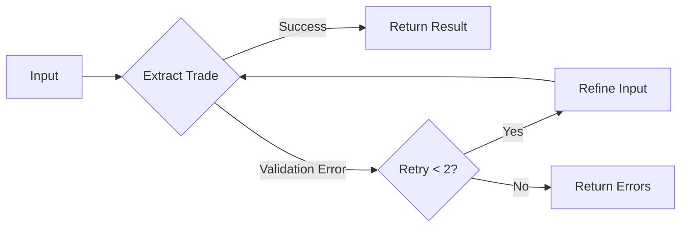

# Extraction Agent

The Extraction Agent parses natural language trade descriptions into structured data using a LangGraph workflow with OpenAI.

## Overview

The extraction agent is a LangGraph-based pipeline that:
1. Receives raw trade descriptions
2. Extracts structured data using OpenAI GPT-4
3. Validates output against Pydantic schemas
4. Retries on validation failures

## LangGraph Workflow



## State Definition

The extraction state is defined as a TypedDict:

```python
class ExtractionState(TypedDict):
    trade_id: str           # UUID of the trade record
    raw_input: str         # Raw natural language input
    extraction: Optional[TradeExtractionResult]  # Extracted data
    validation_errors: list[str]  # Validation error messages
    retry_count: int       # Number of retry attempts
```

## Nodes

### extract_trade_node

Extracts structured data from natural language using OpenAI's structured output.

**Input**: `ExtractionState` with `trade_id`, `raw_input`, `retry_count`

**Output**: Updated state with `extraction` result or `validation_errors`

**Key features**:
- Uses `ChatOpenAI` with `gpt-4o-mini` model
- Implements `with_structured_output()` for Pydantic validation
- 5-second request timeout
- Input sanitization for prompt injection prevention

### refine_extraction_node

Enhances input for retry attempts by appending validation errors.

**Input**: `ExtractionState` with `validation_errors`

**Output**: Updated state with enhanced `raw_input`

## Retry Logic

The agent implements a retry mechanism:

| Retry Count | Behavior |
|-------------|----------|
| 0 | Initial extraction attempt |
| 1 | Retry with error context |
| 2 | Final retry attempt |
| 3+ | Return errors (max retries reached) |

## Output Schema

The extraction produces a `TradeExtractionResult`:

```python
class TradeExtractionResult(BaseModel):
    direction: Literal["long", "short"]
    outcome: Literal["win", "loss", "breakeven"]
    pnl: float  # -10000 to 10000
    setup_description: Optional[str]  # max 2000 chars
    discipline_score: int  # -1, 0, or 1
    agency_score: int  # -1, 0, or 1
    discipline_confidence: Literal["high", "medium", "low"]
    agency_confidence: Literal["high", "medium", "low"]
    behavioral_signals: list[str]
```

## Score Semantics

| Score | Discipline | Agency |
|-------|------------|--------|
| +1 | Excellent execution | Proactive decision-making |
| 0 | Neutral | Neutral |
| -1 | Poor discipline (fOMO, revenge) | Passive/External locus |

## Input Sanitization

The agent sanitizes inputs to prevent prompt injection:

```python
def sanitize_input(raw_input: str) -> str:
    # Remove null bytes
    sanitized = raw_input.replace("\x00", "")

    # Remove prompt injection patterns
    injection_patterns = [
        r"ignore\s+(previous|all)\s+(instructions|prompts?)",
        r"system:\s*",
        r"you\s+are\s+now\s+.*",
        r"developer\s+mode",
        r"override\s+(the\s+)?output",
        r"\{\{.*\}\}",  # Template injection
    ]

    # Collapse multiple whitespace
    sanitized = " ".join(sanitized.split())

    return sanitized
```

## API Endpoint

The extraction is exposed via FastAPI:

```python
# POST /extract
class ExtractionRequest(BaseModel):
    trade_id: str  # UUID
    raw_input: str  # 1-5000 chars

class ExtractionResponse(BaseModel):
    trade_id: str
    success: bool
    message: str
```

## Related Documentation

- [Trade API Endpoints](./api/trades.md)
- [Backend Schemas](./database/schema.md)
- [Frontend TradeEntry Component](./frontend/components.md)
