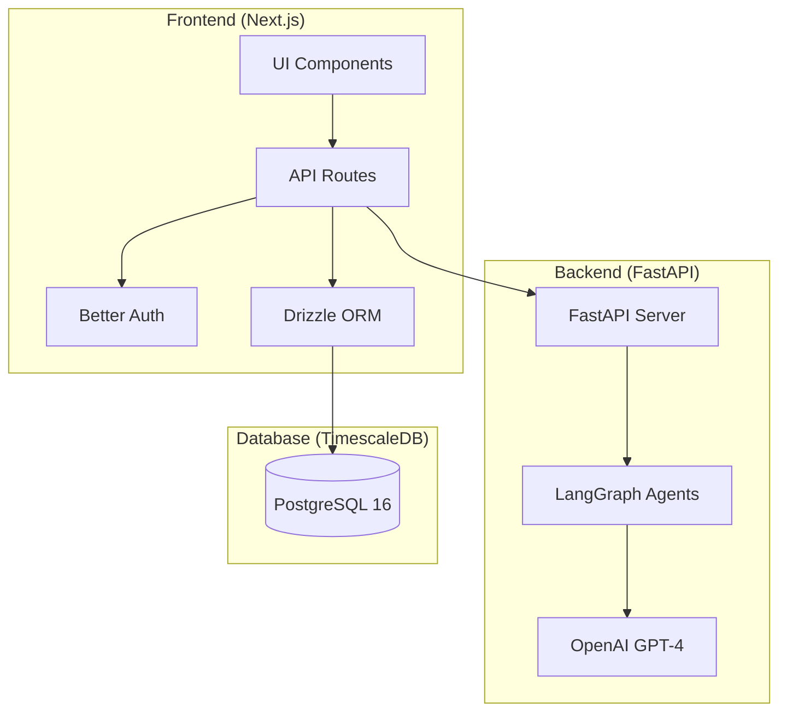
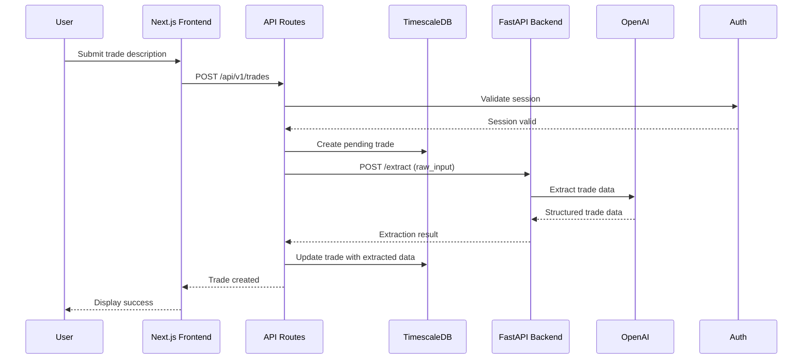
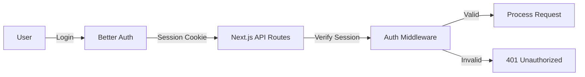

# Architecture Overview

This document provides a system-level overview of the Aurelius Ledger application, including container topology, request flows, and authentication.

## System Overview

Aurelius Ledger is a lightweight web application for logging futures trades during live trading sessions. It uses natural language processing to extract structured trade data from plain text descriptions, providing real-time P&L tracking, discipline and agency score visualization, and AI-powered insights.

## Tech Stack

| Layer | Technology |
|-------|------------|
| Frontend | Next.js (App Router), TypeScript, Shadcn/ui, Tailwind CSS, Better Auth |
| Backend | FastAPI, LangGraph, LangChain, OpenAI |
| Database | TimescaleDB (PostgreSQL 16) |
| ORM | Drizzle |
| AI Agents | CopilotKit, LangGraph |
| Containerization | Docker Compose |

## Container Topology

## Request Flow

## Authentication Flow

Authentication is handled exclusively in the frontend using Better Auth:

## Key Architectural Patterns

1. **Frontend-only Auth**: All authentication logic lives in the Next.js frontend. The backend FastAPI service handles only AI/ML operations.

2. **CopilotKit Proxy**: All CopilotKit traffic flows through the Next.js `/api/copilotkit` proxy endpoint.

3. **Optimistic UI**: Trade submissions use optimistic updates for immediate feedback while server processing completes.

4. **Trade Extraction Pipeline**: Natural language trade descriptions are parsed by a LangGraph agent that extracts:
   - Direction (long/short)
   - Outcome (win/loss/breakeven)
   - P&L amount
   - Setup description
   - Discipline score (-1, 0, +1)
   - Agency score (-1, 0, +1)

## Design System

The application uses a dark trading aesthetic:

- **Background**: slate-950 (#020617), slate-900 (#0F172A)
- **Borders**: slate-800 (#1E293B)
- **Primary Accent**: Blue (#3B82F6) - execution/trades
- **Secondary Accent**: Rose (#F43F5E) - insights/psychology
- **Typography**: Inter for body, JetBrains Mono for code

## Related Documentation

- [Trade API Endpoints](./api/trades.md)
- [Insights API Endpoints](./api/insights.md)
- [Export API Endpoints](./api/export.md)
- [Extraction Agent](./agents/extraction.md)
- [Insights Agent](./agents/insights.md)
- [Database Schema](./database/schema.md)
- [Frontend Components](./frontend/components.md)
