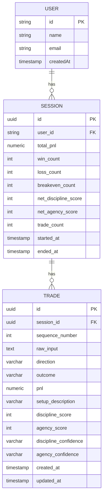

# Database Schema

The Aurelius Ledger uses Drizzle ORM with TimescaleDB. This document covers the core tables and their relationships.

## Schema Overview



## Drizzle Schemas

### Users Table (Better Auth)

Location: `/frontend/src/db/schema/auth.ts`

```typescript
export const user = pgTable("user", {
  id: text("id").primaryKey(),
  name: text("name").notNull(),
  email: text("email").notNull(),
  emailVerified: boolean("email_verified"),
  image: text("image"),
  createdAt: timestamp("created_at").notNull(),
  updatedAt: timestamp("updated_at").notNull(),
});
```

### Sessions Table

Location: `/frontend/src/lib/db/schema/sessions.ts`

```typescript
export const sessions = pgTable('sessions', {
  id: uuid('id').primaryKey().defaultRandom(),
  userId: text('user_id').notNull().references(() => user.id, { onDelete: 'cascade' }),
  totalPnl: numeric('total_pnl', { precision: 12, scale: 2 }).notNull().default('0'),
  winCount: integer('win_count').notNull().default(0),
  lossCount: integer('loss_count').notNull().default(0),
  breakevenCount: integer('breakeven_count').notNull().default(0),
  netDisciplineScore: integer('net_discipline_score').notNull().default(0),
  netAgencyScore: integer('net_agency_score').notNull().default(0),
  tradeCount: integer('trade_count').notNull().default(0),
  startedAt: timestamp('started_at', { withTimezone: true }).notNull().defaultNow(),
  endedAt: timestamp('ended_at', { withTimezone: true }),
}, (table) => [
  index('idx_sessions_user_started').on(table.userId, table.startedAt),
]);
```

### Trades Table

Location: `/frontend/src/lib/db/schema/trades.ts`

```typescript
export const trades = pgTable('trades', {
  id: uuid('id').primaryKey().defaultRandom(),
  sessionId: uuid('session_id').notNull().references(() => sessions.id, { onDelete: 'cascade' }),
  sequenceNumber: integer('sequence_number').notNull(),
  rawInput: text('raw_input').notNull(),
  direction: varchar('direction', { length: 10 }).notNull(),
  outcome: varchar('outcome', { length: 20 }).notNull(),
  pnl: numeric('pnl', { precision: 10, scale: 2 }).notNull().default('0'),
  setupDescription: varchar('setup_description', { length: 2000 }),
  disciplineScore: integer('discipline_score').notNull().default(0),
  agencyScore: integer('agency_score').notNull().default(0),
  disciplineConfidence: varchar('discipline_confidence', { length: 10 }).notNull().default('low'),
  agencyConfidence: varchar('agency_confidence', { length: 10 }).notNull().default('low'),
  createdAt: timestamp('created_at', { withTimezone: true }).notNull().defaultNow(),
  updatedAt: timestamp('updated_at', { withTimezone: true }).notNull().defaultNow(),
}, (table) => [
  index('idx_trades_session_sequence').on(table.sessionId, table.sequenceNumber),
  index('idx_trades_session_created').on(table.sessionId, table.createdAt),
  index('idx_trades_created_at').on(table.createdAt),
]);
```

## Column Types

| Column | Type | Constraints |
|--------|------|-------------|
| id | UUID | Primary key, auto-generated |
| session_id | UUID | Foreign key to sessions |
| direction | VARCHAR(10) | 'long' or 'short' |
| outcome | VARCHAR(20) | 'win', 'loss', or 'breakeven' |
| pnl | NUMERIC(10,2) | Range: -10000 to 10000 |
| discipline_score | INTEGER | -1, 0, or 1 |
| agency_score | INTEGER | -1, 0, or 1 |
| discipline_confidence | VARCHAR(10) | 'high', 'medium', or 'low' |
| agency_confidence | VARCHAR(10) | 'high', 'medium', or 'low' |

## Indexes

| Index Name | Columns | Purpose |
|------------|---------|---------|
| idx_sessions_user_started | user_id, started_at | Query sessions by user |
| idx_trades_session_sequence | session_id, sequence_number | Query trades in order |
| idx_trades_session_created | session_id, created_at | Query trades by time |
| idx_trades_created_at | created_at | Global trade queries |

## Related Documentation

- [Trade API Endpoints](./api/trades.md)
- [Insights API Endpoints](./api/insights.md)
- [Export API Endpoints](./api/export.md)
