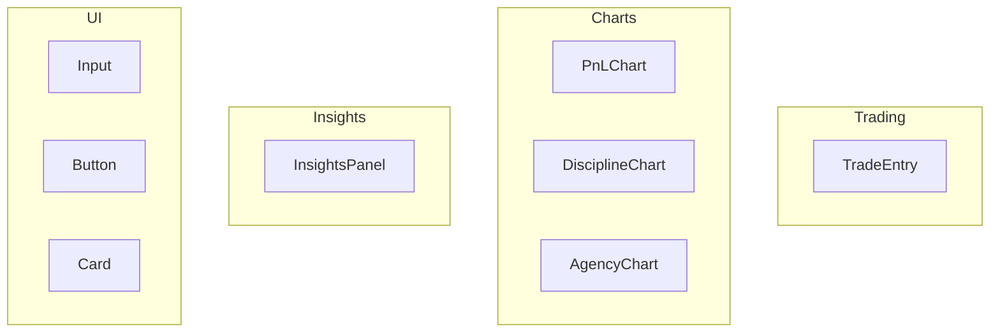

# Frontend Components

This document covers the key React components used in the Aurelius Ledger frontend.

## Component Overview



## TradeEntry Component

Location: `/frontend/src/components/trading/TradeEntry.tsx`

Natural language trade input component fixed at the bottom of the screen.

### Props

```typescript
interface TradeEntryProps {
  className?: string
}
```

### Features

- **FR 1.1**: Accepts any natural language text without format requirements
- **FR 1.2**: Optimistic UI updates for immediate feedback
- **FR 1.3**: Clears input on successful submission
- **FR 1.4**: Green flash visual confirmation on success
- **FR 1.5**: Auto-focuses after submission
- **FR 1.6**: Fixed at bottom of screen

### Usage

```tsx
import { TradeEntry } from '@/components/trading/TradeEntry'

// In your page/component
<TradeEntry />
```

### Styling

- Fixed position: `fixed bottom-0 left-0 right-0 z-50`
- Background: `bg-slate-900/95` with backdrop blur
- Border: `border-t border-slate-800`
- Focus state: Blue accent (`focus-visible:ring-blue-500`)

---

## PnLChart Component

Location: `/frontend/src/components/charts/PnLChart.tsx`

Cumulative P&L area chart using Recharts.

### Props

```typescript
interface PnLChartProps {
  trades: TradeResponse[]
  isLoading?: boolean
  className?: string
}
```

### Features

- **FR 4.1**: Shows cumulative P&L (running total)
- **FR 4.1**: Green when above zero, red when below
- **FR 4.1**: Horizontal reference line at $0
- **FR 4.1**: Tooltips with sequence, timestamp, trade P&L, cumulative P&L, direction, scores
- **FR 4.1**: Line chart with area fill
- **FR 4.1**: Flags extreme values (>3 std dev)
- **FR 4.7**: Average P&L reference line

### Data Processing

```typescript
const chartData = trades.map((trade, index) => {
  cumulative += trade.pnl
  const isExtreme = Math.abs(trade.pnl - mean) > 3 * stdDev
  return {
    sequence: index + 1,
    tradePnl: trade.pnl,
    cumulativePnl: cumulative,
    direction: trade.direction,
    isExtreme,
  }
})
```

---

## DisciplineChart Component

Location: `/frontend/src/components/charts/DisciplineChart.tsx`

Discipline score visualization (similar to PnLChart for scores).

---

## AgencyChart Component

Location: `/frontend/src/components/charts/AgencyChart.tsx`

Agency score visualization (similar to PnLChart for scores).

---

## InsightsPanel Component

Location: `/frontend/src/components/insights/InsightsPanel.tsx`

Displays AI-generated behavioral insights.

### Props

```typescript
interface InsightsPanelProps {
  insights: Insight[]
  generatedAt?: string
  isLoading?: boolean
  className?: string
}
```

### Insight Display

- Shows max 3 insights
- Color-coded by severity:
  - `success`: Green border/bg
  - `warning`: Yellow border/bg
  - `info`: Default slate styling
- Shows "Last updated" timestamp
- Loading skeleton animation

---

## WarningIndicator Component

Location: `/frontend/src/components/charts/WarningIndicator.tsx`

Displays behavioral warnings in the dashboard.

### Props

```typescript
interface WarningIndicatorProps {
  level: 'none' | 'amber' | 'orange'
  message: string
}
```

---

## UI Components (Shadcn/ui)

The following Shadcn/ui components are used:

| Component | Location | Usage |
|-----------|----------|-------|
| Input | `/components/ui/input.tsx` | Text input fields |
| Button | `/components/ui/button.tsx` | Action buttons |
| Card | `/components/ui/card.tsx` | Content containers |
| Label | `/components/ui/label.tsx` | Form labels |

## Related Documentation

- [Trade API Endpoints](./api/trades.md)
- [Frontend Hooks](./hooks.md)
- [Design System](#design-system)
