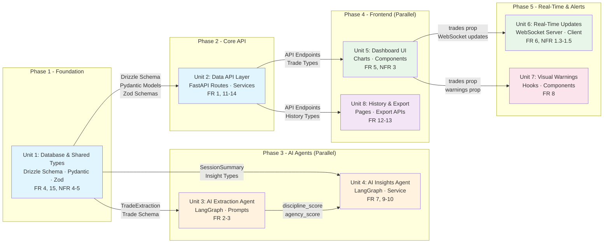

# Implementation Plan: Aurelius Ledger

## Implementation Units Overview

| Unit | Name | FR Coverage | Complexity | Dependencies |
|------|------|-------------|------------|--------------|
| 1 | Database & Shared Types | FR 4.0, FR 15.0, NFR 4.0-5.0 | Medium | None (Foundation) |
| 2 | Data API Layer | FR 1.0, FR 11.0-14.0 | Medium | Unit 1 |
| 3 | AI Extraction Agent | FR 2.0, FR 3.0 | High | Unit 1, Unit 2 (data save) |
| 4 | AI Insights Agent | FR 7.0, FR 9.0, FR 10.0 | High | Unit 1, Unit 3 (scores) |
| 5 | Dashboard UI | FR 5.0, NFR 3.0 | Medium | Unit 2 (API) |
| 6 | Real-Time Updates | FR 6.0, NFR 1.3-1.5 | Medium | Unit 2, Unit 5 |
| 7 | Visual Warnings | FR 8.0 | Low | Unit 5 |
| 8 | History & Export | FR 12.0, FR 13.0 | Low | Unit 2 |

## Dependency Graph



## Unit Definitions

### Unit 1: Database & Shared Types

**Scope:** Establish the foundation layer with database schema, type definitions, and validation schemas shared across frontend and backend.

**Owns (files/directories):**
- `frontend/src/db/schema/trading.ts` - Drizzle ORM schema for trades and trading_days tables
- `frontend/src/db/schema/auth.ts` - Better Auth table definitions
- `frontend/src/lib/schemas/trade.ts` - Zod validation schemas for frontend
- `backend/src/schemas/trade.py` - Pydantic models for trade extraction and validation
- `backend/src/schemas/insights.py` - Pydantic models for insights generation
- Database migrations and TimescaleDB hypertable setup

**FR Coverage:**
- FR 4.0 (Data Persistence) - Schema definitions
- FR 15.0 (Database Schema) - Full schema specification
- NFR 4.0 (Scalability) - Index definitions
- NFR 5.0 (Data Retention) - Retention policy setup

**Dependencies:**
- None (foundation layer)

**Interface Contract - Exports:**
```typescript
// Frontend Zod Schema
export const TradeEntrySchema = z.object({
  description: z.string().min(1).max(2000)
})

export interface Trade {
  id: string
  tradingDayId: string
  timestamp: Date
  direction: 'long' | 'short'
  outcome: 'win' | 'loss' | 'breakeven'
  pnl: number
  setupDescription?: string
  disciplineScore: number
  agencyScore: number
  confidenceScore: number
  isEstimatedPnl: boolean
}

export interface TradingDay {
  id: string
  userId: string
  date: Date
  totalPnl: number
  winCount: number
  lossCount: number
  breakevenCount: number
  disciplineSum: number
  agencySum: number
  peakPnl: number
  troughPnl: number
  largestWin: number
  largestLoss: number
  consecutiveWins: number
  consecutiveLosses: number
}
```

```python
# Backend Pydantic Models
class TradeExtraction(BaseModel):
    direction: Literal["long", "short"]
    outcome: Literal["win", "loss", "breakeven"]
    pnl: Decimal
    setup_description: str
    discipline_score: int
    agency_score: int
    confidence_score: float
    is_estimated_pnl: bool

class SessionSummary(BaseModel):
    pnl_statistics: PnlStatistics
    outcome_distribution: OutcomeDistribution
    discipline_trend: TrendData
    agency_trend: TrendData
    recent_trades: List[TradeDetail]
    tilt_risk_score: int
```

**Interface Contract - Imports:**
- None (foundation)

---

### Unit 2: Data API Layer

**Scope:** Implement FastAPI routes for trade CRUD, session management, and data validation services.

**Owns (files/directories):**
- `backend/src/routers/trades.py` - Trade CRUD endpoints
- `backend/src/routers/insights.py` - Insights generation endpoint
- `backend/src/routers/sessions.py` - Session summary endpoint
- `backend/src/services/trading_day_service.py` - Aggregate updates
- `backend/src/services/validation_service.py` - Data validation
- `backend/src/services/session_service.py` - Session detection
- `frontend/src/app/api/v1/trades/route.ts` - Frontend API proxy
- `frontend/src/app/api/v1/trading-days/` - History endpoints

**FR Coverage:**
- FR 1.0 (Trade Entry System) - POST /api/v1/trades endpoint
- FR 11.0 (Session Management) - Session detection and summary
- FR 12.0 (Historical Data Access) - History list and detail endpoints
- FR 13.0 (Data Export) - JSON/CSV export endpoints
- FR 14.0 (Data Quality) - Validation service

**Dependencies:**
- Unit 1 (Database Schema)

**Interface Contract - Exports:**
```python
# API Endpoints
POST /api/v1/trades
  Request: { "description": string }
  Response: { "success": true, "data": { "trade": Trade, "insights": Insight[] } }

GET /api/v1/trading-days/history?page=1&limit=20
  Response: { "success": true, "data": TradingDaySummary[], "meta": {...} }

GET /api/v1/trading-days/{id}
  Response: { "success": true, "data": { "tradingDay": TradingDay, "trades": Trade[] } }

GET /api/v1/trading-days/{id}/export/json
GET /api/v1/trading-days/export/csv?start_date=&end_date=

POST /api/v1/sessions/summary
  Response: { "win_rate": float, "discipline_trend": str, "key_insight": str }
```

**Interface Contract - Imports:**
- Drizzle schema from Unit 1
- Pydantic models from Unit 1

---

### Unit 3: AI Extraction Agent

**Scope:** Implement LangGraph-based extraction pipeline for parsing natural language trade descriptions into structured data with behavioral scoring.

**Owns (files/directories):**
- `backend/src/agents/extraction/graph.py` - LangGraph extraction pipeline
- `backend/src/agents/extraction/prompts.py` - Extraction prompt templates
- `backend/src/agents/extraction/client.py` - OpenAI LLM client with timeout config
- `backend/src/routers/trades.py` - Extraction endpoint integration

**FR Coverage:**
- FR 2.0 (AI Trade Extraction) - Full extraction pipeline
- FR 2.1-2.9 - All extraction requirements
- FR 3.0 (Behavioral Scoring) - Embedded in extraction
- FR 3.1-3.7 - All behavioral scoring criteria
- NFR 1.2 - LLM timeout handling

**Dependencies:**
- Unit 1 (TradeExtraction Pydantic model)
- Unit 2 (for persistence after extraction)

**Interface Contract - Exports:**
```python
# Extraction Result
class ExtractionResult(BaseModel):
    success: bool
    trade: Optional[TradeExtraction]
    error: Optional[str]
    retry_count: int
    prompt_version: str

# API Endpoint
POST /api/v1/trades/extract
  Request: { "description": string }
  Response: { "success": true, "data": TradeExtraction }
```

**Interface Contract - Imports:**
- TradeExtraction Pydantic model (Unit 1)
- Validation schemas from Unit 1

**Mock Strategy for Parallel Development:**
- Return mock TradeExtraction with randomized valid values
- Store descriptions for later processing against real agent

---

### Unit 4: AI Insights Agent

**Scope:** Implement insights generation using session summary data with tilt detection, positive reinforcement, and recovery highlighting.

**Owns (files/directories):**
- `backend/src/agents/insights/prompts.py` - Insights prompt templates
- `backend/src/agents/insights/service.py` - Insights generation logic
- `backend/src/services/insights_service.py` - Tilt calculation, positive pattern detection, recovery detection

**FR Coverage:**
- FR 7.0 (AI Insights Generation) - Full insights pipeline
- FR 7.1-7.10 - All insights requirements
- FR 9.0 (Positive Reinforcement) - Strengths detection
- FR 10.0 (Recovery Detection) - Recovery highlighting

**Dependencies:**
- Unit 1 (SessionSummary, Insight types)
- Unit 3 (discipline_score, agency_score from extraction)

**Interface Contract - Exports:**
```python
# Insight Types
class Insight(BaseModel):
    type: Literal["tilt_risk", "discipline", "agency", "outcome"]
    priority: int
    text: str
    actionable: bool

# API Endpoint
POST /api/v1/insights/generate
  Request: { "session_summary": SessionSummary, "session_phase": "mid_session" | "post_session" }
  Response: { "success": true, "data": { "insights": Insight[], "tilt_risk_score": int } }
```

**Interface Contract - Imports:**
- SessionSummary Pydantic model (Unit 1)
- Trade data from database (Unit 2)

**Mock Strategy for Parallel Development:**
- Return static insights based on session phase
- Generate mock tilt risk scores

---

### Unit 5: Dashboard UI

**Scope:** Implement the main trading dashboard with charts, session summary, and trade entry input.

**Owns (files/directories):**
- `frontend/src/app/dashboard/page.tsx` - Main dashboard layout
- `frontend/src/components/dashboard/TradeEntryInput.tsx` - Natural language input
- `frontend/src/components/dashboard/pnl-chart.tsx` - Cumulative P&L chart
- `frontend/src/components/dashboard/discipline-chart.tsx` - Discipline score chart
- `frontend/src/components/dashboard/agency-chart.tsx` - Agency score chart
- `frontend/src/components/dashboard/insights-panel.tsx` - AI insights display
- `frontend/src/components/dashboard/session-summary.tsx` - Header stats bar
- `frontend/src/components/dashboard/DashboardContainer.tsx` - Layout wrapper

**FR Coverage:**
- FR 5.0 (Dashboard Display) - All requirements
- FR 5.1-5.9 - Layout, charts, colors
- NFR 3.0 (Usability) - Dark theme, visual indicators

**Dependencies:**
- Unit 2 (API endpoints for data)
- Unit 1 (Type definitions)

**Interface Contract - Exports:**
```typescript
// Components exported for use
<DashboardPage />
<TradeEntryInput onSubmit={fn} />
<PnlChart trades={Trade[]} />
<DisciplineChart trades={Trade[]} />
<AgencyChart trades={Trade[]} />
<InsightsPanel insights={Insight[]} />
<SessionSummary tradingDay={TradingDay} />
```

**Interface Contract - Imports:**
- Trade[] and TradingDay types from Unit 1
- API calls to Unit 2 endpoints

---

### Unit 6: Real-Time Updates

**Scope:** Implement WebSocket server for push updates and frontend client for real-time dashboard refresh.

**Owns (files/directories):**
- `backend/src/websockets/dashboard.py` - WebSocket connection manager
- `frontend/src/lib/websocket.ts` - WebSocket client hook
- `frontend/src/hooks/use-realtime-dashboard.ts` - Real-time dashboard hook
- `frontend/src/hooks/use-debounced-update.ts` - Debounce utility

**FR Coverage:**
- FR 6.0 (Real-Time Updates) - All requirements
- FR 6.1-6.4 - WebSocket, throttling, animations
- NFR 1.3-1.5 - Latency and debounce requirements

**Dependencies:**
- Unit 2 (for initial data fetch)
- Unit 5 (for UI updates)

**Interface Contract - Exports:**
```typescript
// Frontend Hook
function useRealtimeDashboard(options: {
  url: string
  onMessage: (data: DashboardUpdate) => void
  lastTradeTime: Date | null
}): { status: ConnectionStatus, send: WebSocket['send'] }

interface DashboardUpdate {
  type: 'trade_added' | 'trade_updated'
  trade: Trade
  tradingDay: TradingDay
}
```

```python
# Backend WebSocket
@app.websocket("/ws/dashboard/{user_id}")
async def websocket_endpoint(websocket: WebSocket, user_id: str)
```

**Interface Contract - Imports:**
- Trade and TradingDay types from Unit 1

---

### Unit 7: Visual Warnings

**Scope:** Implement warning detection logic and visual alert components for behavioral warning patterns.

**Owns (files/directories):**
- `frontend/src/hooks/use-warning-detection.ts` - Warning state detection
- `frontend/src/components/dashboard/DashboardContainer.tsx` - Visual warning styling

**FR Coverage:**
- FR 8.0 (Visual Warnings) - All requirements
- FR 8.1-8.3 - Yellow and red warning conditions

**Dependencies:**
- Unit 5 (for dashboard container)
- Unit 1 (Trade and TradingDay types)

**Interface Contract - Exports:**
```typescript
interface WarningState {
  level: 'none' | 'yellow' | 'red'
  reasons: string[]
}

function useWarningDetection(trades: Trade[], tradingDay: TradingDay): WarningState
```

**Interface Contract - Imports:**
- Trade[] and TradingDay from Unit 1 (via Unit 5)

---

### Unit 8: History & Export

**Scope:** Implement historical data access pages and data export functionality.

**Owns (files/directories):**
- `frontend/src/app/dashboard/history/page.tsx` - Historical sessions page
- `frontend/src/components/history/trade-history-list.tsx` - History list component
- `backend/src/routers/trading_days.py` - Trading days endpoints
- Export functionality (already in Unit 2)

**FR Coverage:**
- FR 12.0 (Historical Data Access) - History list and detail
- FR 13.0 (Data Export) - JSON/CSV export

**Dependencies:**
- Unit 2 (API endpoints)

**Interface Contract - Exports:**
```typescript
// History Page Component
function HistoryPage() {
  // Shows list of past trading days
  // Click to view day details (read-only dashboard)
}

// Export Types
type ExportFormat = 'json' | 'csv'
```

**Interface Contract - Imports:**
- TradingDaySummary types from Unit 2
- Trade[] and TradingDay types from Unit 1

---

## Implementation Sequence

### Phase 1: Foundation (Unit 1)
1. Create Drizzle ORM schema in `frontend/src/db/schema/trading.ts`
2. Create Pydantic models in `backend/src/schemas/trade.py` and `insights.py`
3. Create Zod schemas in `frontend/src/lib/schemas/trade.ts`
4. Run database migrations

### Phase 2: Core API (Unit 2)
1. Implement trade CRUD endpoints
2. Implement trading day service for aggregates
3. Implement validation service
4. Create frontend API routes

### Phase 3: AI Agents (Parallel - Units 3 & 4)
1. **Unit 3:** Build LangGraph extraction pipeline with retry logic
2. **Unit 4:** Build insights generation with tilt detection

### Phase 4: Frontend (Parallel - Units 5 & 8)
1. **Unit 5:** Build dashboard UI components
2. **Unit 8:** Build history pages

### Phase 5: Real-Time & Alerts (Units 6 & 7)
1. **Unit 6:** Implement WebSocket server and client
2. **Unit 7:** Implement warning detection and visual alerts

## Parallelization Opportunities

1. **Units 3 & 4** can run in parallel after Unit 2 completes - they both consume extraction results but don't depend on each other
2. **Units 5 & 8** can run in parallel after Unit 2 - they both call the same API endpoints
3. **Units 6 & 7** can run in parallel after Unit 5 - they both depend on dashboard state

## Critical Path

The critical path is: **Unit 1 → Unit 2 → Unit 3 → Unit 4 → Unit 5**

This chain cannot be parallelized because:
- Unit 2 needs the schema from Unit 1
- Unit 3 needs to save extracted trades (Unit 2)
- Unit 4 needs behavioral scores from Unit 3
- Unit 5 needs API endpoints from Unit 2
