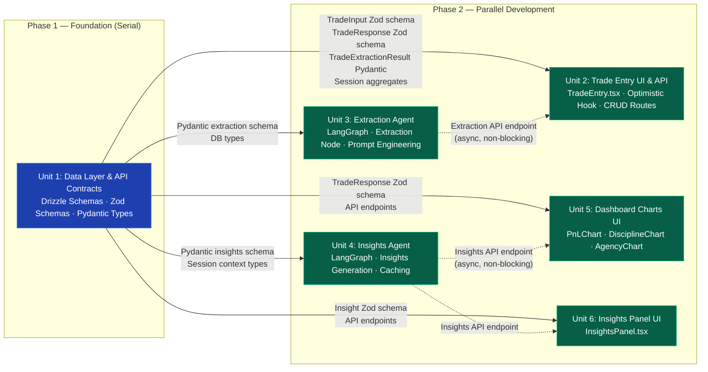

# Implementation Plan: Aurelius Ledger

## Implementation Units Overview

This document decomposes the technical requirements into parallelizable implementation units optimized for concurrent development across isolated worktrees.

| Unit | Name | Description | FR Coverage | Complexity | Dependencies |
|------|------|-------------|-------------|------------|--------------|
| 1 | Data Layer & API Contracts | Database schemas, Zod validation, Pydantic types | FR 3.0-3.4 | High | None (Foundation) |
| 2 | Trade Entry UI & API | Input component, optimistic hooks, CRUD routes | FR 1.0-1.2 | Medium | Unit 1 (Types) |
| 3 | Extraction Agent | LangGraph node for AI trade parsing | FR 2.0-2.10 | High | Unit 1 (Types) |
| 4 | Insights Agent | LangGraph node for AI behavioral insights | FR 5.0-5.6 | High | Unit 1 (Types) |
| 5 | Dashboard Charts UI | P&L, Discipline, Agency visualizations | FR 4.0-4.8 | Medium | Unit 1 (Types), Unit 2 (Trades API) |
| 6 | Insights Panel UI | Display component for AI insights | FR 5.6 | Low | Unit 4 (Insights API) |

## Dependency Graph



**Legend:**
- Solid arrows indicate HARD dependencies (must complete before downstream can start)
- Dashed arrows indicate SOFT dependencies (can develop against mocks/stubs)
- Foundation unit (Unit 1) is serial - all other units depend on its type definitions

## Unit Definitions

### Unit 1: Data Layer & API Contracts

**Scope:** Define all shared type definitions, database schemas, and validation contracts that all other units depend on. This is the foundation layer that must be completed first.

**Owns (files/directories):**
- `frontend/src/lib/db/schema/trades.ts` — Drizzle schema for trades table
- `frontend/src/lib/db/schema/sessions.ts` — Drizzle schema for sessions table
- `frontend/src/lib/schemas/trade.ts` — Zod validation schemas (tradeInputSchema, tradeResponseSchema)
- `frontend/src/lib/schemas/insights.ts` — Zod validation schemas for insights
- `backend/src/schemas/trade_extraction.py` — Pydantic extraction result schema
- `backend/src/schemas/insights.py` — Pydantic insights response schema
- `frontend/drizzle/0010_trades_sessions.sql` — Database migration for TimescaleDB hypertable
- `frontend/drizzle/0011_session_aggregates.sql` — Database trigger for atomic updates

**FR Coverage:**
- FR 3.0 — Trade Persistence (schema, relationships, indexes)
- FR 3.1 — Session Aggregates (pre-computed columns, triggers)
- FR 3.2 — Data Quality Validation (P&L bounds, timestamp)
- FR 3.3 — Data Export (JSON/CSV endpoints)
- FR 3.4 — TimescaleDB Optimization (hypertable)

**Dependencies:**
- None — This is the foundation layer

**Interface Contract — Exports:**
```typescript
// Frontend: TradeInput (Zod)
const tradeInputSchema = z.object({
  raw_input: z.string().min(1).max(5000).trim(),
})
type TradeInput = z.infer<typeof tradeInputSchema>

// Frontend: TradeResponse (Zod)
const tradeResponseSchema = z.object({
  id: z.string().uuid(),
  session_id: z.string().uuid(),
  sequence_number: z.number().int().positive(),
  direction: z.enum(['long', 'short']),
  outcome: z.enum(['win', 'loss', 'breakeven']),
  pnl: z.number(),
  setup_description: z.string().max(2000).nullable(),
  discipline_score: z.number().int().min(-1).max(1),
  agency_score: z.number().int().min(-1).max(1),
  discipline_confidence: z.enum(['high', 'medium', 'low']),
  agency_confidence: z.enum(['high', 'medium', 'low']),
  created_at: z.string().datetime(),
})
type TradeResponse = z.infer<typeof tradeResponseSchema>

// Frontend: Session (Drizzle)
type Session = typeof sessions.$inferSelect
type NewSession = typeof sessions.$inferInsert

// Backend: ExtractionResult (Pydantic)
class TradeExtractionResult(BaseModel):
    direction: Literal["long", "short"]
    outcome: Literal["win", "loss", "breakeven"]
    pnl: float = Field(..., ge=-10000, le=10000)
    setup_description: Optional[str] = Field(None, max_length=2000)
    discipline_score: int = Field(..., ge=-1, le=1)
    agency_score: int = Field(..., ge=-1, le=1)
    discipline_confidence: Literal["high", "medium", "low"]
    agency_confidence: Literal["high", "medium", "low"]
    behavioral_signals: list[str]
```

**Interface Contract — Imports:**
- None — This unit produces exports only

**Mock Strategy:**
- N/A — Foundation layer has no dependencies

**Requirements:**

#### FR 3.0 Trade Persistence

The system **SHALL** persist trade data with proper schema and relationships.

- **FR 3.1** The system **SHALL** store trades in a `trades` table with the following schema:
  - `id`: UUID (primary key)
  - `session_id`: UUID (foreign key to sessions)
  - `sequence_number`: INTEGER
  - `raw_input`: TEXT (original natural language input)
  - `direction`: VARCHAR(10) - "long" or "short"
  - `outcome`: VARCHAR(20) - "win", "loss", or "breakeven"
  - `pnl`: NUMERIC(10,2) - dollar value (positive for wins, negative for losses)
  - `setup_description`: VARCHAR(2000)
  - `discipline_score`: INTEGER (-1, 0, or +1)
  - `agency_score`: INTEGER (-1, 0, or +1)
  - `discipline_confidence`: VARCHAR(10) - "high", "medium", or "low"
  - `agency_confidence`: VARCHAR(10) - "high", "medium", or "low"
  - `created_at`: TIMESTAMPTZ (timezone-aware)
- **FR 3.2** Each trade **SHALL** have a sequence number within its session.
- **FR 3.3** Each trade **SHALL** include confidence scores for discipline and agency.
- **FR 3.4** The system **SHALL** create a trading session automatically when the first trade of a calendar day is logged.
- **FR 3.5** The system **SHALL** store the original raw input text in a separate column for audit purposes and future re-processing.

*Source: HLRD Section 3.1; Data Analytics SME Phase 4 Review - Data Types & Raw Input Storage*

**Technical Implementation:**

Drizzle Schema (`frontend/src/lib/db/schema/trades.ts`):
```typescript
import { pgTable, uuid, varchar, text, numeric, integer, timestamp, index, foreignKey } from 'drizzle-orm/pg-core'
import { sessions } from './sessions'

export const trades = pgTable('trades', {
  id: uuid('id').primaryKey().defaultRandom(),
  sessionId: uuid('session_id').notNull().references(() => sessions.id, { onDelete: 'cascade' }),
  sequenceNumber: integer('sequence_number').notNull(),
  rawInput: text('raw_input').notNull(),
  direction: varchar('direction', { length: 10 }).notNull(),
  outcome: varchar('outcome', { length: 20 }).notNull(),
  pnl: numeric('pnl', { precision: 10, scale: 2 }).notNull().default('0'),
  setupDescription: varchar('setup_description', { length: 2000 }),
  disciplineScore: integer('discipline_score').notNull().default(0),
  agencyScore: integer('agency_score').notNull().default(0),
  disciplineConfidence: varchar('discipline_confidence', { length: 10 }).notNull().default('low'),
  agencyConfidence: varchar('agency_confidence', { length: 10 }).notNull().default('low'),
  extractionStatus: varchar('extraction_status', { length: 20 }).notNull().default('pending'),
  createdAt: timestamp('created_at', { withTimezone: true }).notNull().defaultNow(),
  updatedAt: timestamp('updated_at', { withTimezone: true }).notNull().defaultNow(),
}, (table) => [
  index('idx_trades_session_sequence').on(table.sessionId, table.sequenceNumber),
  index('idx_trades_session_created').on(table.sessionId, table.createdAt),
  index('idx_trades_created_at').on(table.createdAt),
])
```

Sessions Schema (`frontend/src/lib/db/schema/sessions.ts`):
```typescript
export const sessions = pgTable('sessions', {
  id: uuid('id').primaryKey().defaultRandom(),
  userId: uuid('user_id').notNull().references(() => users.id, { onDelete: 'cascade' }),
  totalPnl: numeric('total_pnl', { precision: 12, scale: 2 }).notNull().default('0'),
  winCount: integer('win_count').notNull().default(0),
  lossCount: integer('loss_count').notNull().default(0),
  breakevenCount: integer('breakeven_count').notNull().default(0),
  netDisciplineScore: integer('net_discipline_score').notNull().default(0),
  netAgencyScore: integer('net_agency_score').notNull().default(0),
  tradeCount: integer('trade_count').notNull().default(0),
  startedAt: timestamp('started_at', { withTimezone: true }).notNull().defaultNow(),
  endedAt: timestamp('ended_at', { withTimezone: true }),
}, (table) => [
  index('idx_sessions_user_started').on(table.userId, table.startedAt),
])
```

SQL Migration (`frontend/drizzle/0010_trades_sessions.sql`):
```sql
-- TimescaleDB hypertable
SELECT create_hypertable('trades', 'created_at', if_not_exists => TRUE);

-- Data quality validation trigger
CREATE OR REPLACE FUNCTION validate_trade_pnl()
RETURNS TRIGGER AS $$
BEGIN
  IF NEW.pnl < -100000 OR NEW.pnl > 100000 THEN
    RAISE WARNING 'Trade P&L % exceeds reasonable bounds', NEW.pnl;
  END IF;
  IF NEW.created_at > NOW() THEN
    RAISE WARNING 'Trade timestamp is in the future: %', NEW.created_at;
  END IF;
  RETURN NEW;
END;
$$ LANGUAGE plpgsql;
```

#### FR 3.1 Session Aggregates

The system **SHALL** maintain running aggregates on the trading session record, updated after each trade insertion.

- **FR 3.1.1** The system **SHALL** store and update: total_pnl, win_count, loss_count, breakeven_count, net_discipline_score, net_agency_score, trade_count.
- **FR 3.1.2** Aggregate updates **SHALL** occur atomically within the same transaction as trade insertion.
- **FR 3.1.3** The system **SHALL** compute aggregates in O(1) time using pre-computed columns.
- **FR 3.1.4** The system **SHALL** index trades by (session_id, sequence_number).
- **FR 3.1.5** The system **SHALL** add composite indexes for (session_id, created_at) and (created_at).

*Source: HLRD Section 3.2; Data Analytics SME Phase 2 Q4, Q8*

**Technical Implementation:**

Database Trigger (`frontend/drizzle/0011_session_aggregates.sql`):
```sql
CREATE OR REPLACE FUNCTION update_session_aggregates()
RETURNS TRIGGER AS $$
BEGIN
  UPDATE sessions
  SET
    trade_count = trade_count + 1,
    total_pnl = total_pnl + NEW.pnl,
    win_count = win_count + CASE WHEN NEW.outcome = 'win' THEN 1 ELSE 0 END,
    loss_count = loss_count + CASE WHEN NEW.outcome = 'loss' THEN 1 ELSE 0 END,
    breakeven_count = breakeven_count + CASE WHEN NEW.outcome = 'breakeven' THEN 1 ELSE 0 END,
    net_discipline_score = net_discipline_score + NEW.discipline_score,
    net_agency_score = net_agency_score + NEW.agency_score
  WHERE id = NEW.session_id;
  RETURN NEW;
END;
$$ LANGUAGE plpgsql;

CREATE TRIGGER trg_update_session_aggregates
  AFTER INSERT ON trades
  FOR EACH ROW
  EXECUTE FUNCTION update_session_aggregates();
```

#### FR 3.2 Data Quality Validation

The system **SHALL** validate data quality at ingestion.

- **FR 3.2.1** The system **SHALL** validate P&L values are within reasonable bounds (-$100,000 to +$100,000 per trade) and flag outliers.
- **FR 3.2.2** The system **SHALL** validate timestamp is not in the future.

*Source: Data Analytics SME Phase 4 Review - Data Quality Validation*

#### FR 3.3 Data Export

The system **SHALL** support data export for backup and analysis.

- **FR 3.3.1** The system **SHALL** support exporting session data as JSON.
- **FR 3.3.2** The system **SHALL** support exporting all trades as CSV.

*Source: Data Analytics SME Phase 4 Review - Data Export*

#### FR 3.4 TimescaleDB Optimization

The system **SHALL** leverage TimescaleDB features for optimal time-series performance.

- **FR 3.4.1** The trades table **SHALL** be created as a TimescaleDB hypertable partitioned by `created_at`.

*Source: Data Analytics SME Phase 4 Review - TimescaleDB-Specific Optimizations*

---

### Unit 2: Trade Entry UI & API

**Scope:** Build the frontend trade input component with optimistic UI updates and the backend API routes for trade CRUD operations.

**Owns (files/directories):**
- `frontend/src/components/trading/TradeEntry.tsx` — Natural language input component
- `frontend/src/hooks/useOptimisticTrades.ts` — Optimistic UI hook
- `frontend/src/app/api/v1/trades/route.ts` — POST/GET trades endpoint
- `frontend/src/app/api/v1/trades/[id]/adjust/route.ts` — PATCH score adjustment endpoint
- `frontend/src/app/api/v1/export/route.ts` — JSON/CSV export endpoint

**FR Coverage:**
- FR 1.0 — Natural Language Trade Input
- FR 1.1 — Input auto-population, clearing, visual confirmation, auto-focus
- FR 1.2 — Trade Submission Flow (optimistic UI, loading states)
- FR 4.8 — Self-Report Calibration (score adjustment modal)

**Dependencies:**
- **Unit 1** — Requires: `tradeInputSchema`, `tradeResponseSchema`, Drizzle `trades` and `sessions` schemas

**Interface Contract — Exports:**
```typescript
// API Response type
interface TradeApiResponse {
  data: TradeResponse
  meta?: { sequence_number: number }
}

// Export formats
type ExportFormat = 'json' | 'csv'
```

**Interface Contract — Imports:**
- `tradeInputSchema` from `frontend/src/lib/schemas/trade`
- `TradeResponse` from `frontend/src/lib/schemas/trade`
- `db` from `frontend/src/lib/db`
- `trades`, `sessions` from `frontend/src/lib/db/schema`

**Mock Strategy:**
- Frontend can mock API responses with mock data matching `TradeResponse` shape
- Backend can use in-memory storage for testing without TimescaleDB

**Requirements:**

#### FR 1.0 Natural Language Trade Input

The system **SHALL** provide a persistent text input at the bottom of the dashboard that accepts free-form natural language descriptions of completed trades.

- **FR 1.1** The system **SHALL** accept any natural language text describing a trade without requiring a specific format or structure.
- **FR 1.2** The system **SHALL** auto-populate the timestamp at the moment of submission.
- **FR 1.3** The system **SHALL** clear the input field upon successful submission.
- **FR 1.4** The system **SHALL** display a visual confirmation (green flash) upon successful trade logging.
- **FR 1.5** The input field **SHALL** auto-focus after each submission to enable rapid logging.
- **FR 1.6** The input **SHALL** remain fixed at the bottom of the screen and remain accessible without navigation.

*Source: HLRD Section 1.1; Behavioral Psychology SME Phase 1 Section 4.1*

**Technical Implementation:**

Frontend Component (`frontend/src/components/trading/TradeEntry.tsx`):
```typescript
import { useState, useRef, useEffect } from 'react'
import { useMutation } from '@tanstack/react-query'
import { tradeInputSchema, type TradeInput } from '@/lib/schemas/trade'

export function TradeEntry() {
  const inputRef = useRef<HTMLTextAreaElement>(null)
  const [input, setInput] = useState('')
  const [showSuccess, setShowSuccess] = useState(false)

  const mutation = useMutation({
    mutationFn: async (data: TradeInput) => {
      const response = await fetch('/api/v1/trades', {
        method: 'POST',
        headers: { 'Content-Type': 'application/json' },
        body: JSON.stringify(data),
      })
      if (!response.ok) throw new Error('Trade submission failed')
      return response.json()
    },
    onSuccess: () => {
      setInput('')
      setShowSuccess(true)
      setTimeout(() => setShowSuccess(false), 1000)
      inputRef.current?.focus()
    },
  })

  const handleSubmit = async (e: React.FormEvent) => {
    e.preventDefault()
    if (!input.trim()) return
    const validated = tradeInputSchema.parse({ raw_input: input.trim() })
    mutation.mutate(validated)
  }

  return (
    <form onSubmit={handleSubmit} className="fixed bottom-0 left-0 right-0 p-4 bg-slate-900 border-t border-slate-800">
      <div className="max-w-4xl mx-auto flex gap-3">
        <textarea
          ref={inputRef}
          value={input}
          onChange={(e) => setInput(e.target.value)}
          placeholder="Describe your trade... (e.g., 'Short ES at 4800, made $250, chased the entry')"
          className={`flex-1 bg-slate-800 border rounded-lg px-4 py-3 text-white ${
            showSuccess ? 'border-green-500 ring-green-500/30' : 'border-slate-700 focus:ring-blue-500/30'
          }`}
          rows={2}
        />
        <Button type="submit" disabled={mutation.isPending || !input.trim()}>
          {mutation.isPending ? 'Saving...' : 'Log Trade'}
        </Button>
      </div>
    </form>
  )
}
```

API Endpoint (`frontend/src/app/api/v1/trades/route.ts`):
```typescript
export async function POST(request: NextRequest) {
  const session = await auth()
  if (!session?.user?.id) {
    return NextResponse.json({ error: 'Unauthorized' }, { status: 401 })
  }

  const body = await request.json()
  const validated = tradeInputSchema.parse(body)

  // Get or create today's trading session
  // Insert trade with pending extraction status
  // Trigger async extraction
  // Return response
}
```

**Security Considerations:**
- Input sanitization at API boundary (Zod validation)
- Rate limiting: Max 30 trades per minute per user
- CSRF protection via Next.js built-in mechanisms
- User authorization verified via session check

#### FR 1.2 Trade Submission Flow

The system **SHALL** process trade submissions with immediate feedback and no page refresh.

- **FR 1.2.1** The system **SHALL** use optimistic UI updates, displaying the submitted trade data immediately.
- **FR 1.2.2** The system **SHALL** sync with the server response after submission to ensure consistency.
- **FR 1.2.3** The system **SHALL** show a loading state during trade processing.

*Source: Data Analytics SME Phase 2 Q1*

**Technical Implementation:**

Optimistic UI Hook (`frontend/src/hooks/useOptimisticTrades.ts`):
```typescript
export function useOptimisticTrades() {
  const queryClient = useQueryClient()
  const [pendingTrades, setPendingTrades] = useState<Map<string, TradeResponse>>(new Map())

  const addOptimisticTrade = useCallback((tempId: string, rawInput: string) => {
    const optimistic: TradeResponse = {
      id: tempId,
      session_id: '',
      sequence_number: 0,
      direction: 'long',
      outcome: 'breakeven',
      pnl: 0,
      setup_description: null,
      discipline_score: 0,
      agency_score: 0,
      discipline_confidence: 'low',
      agency_confidence: 'low',
      created_at: new Date().toISOString(),
    }
    setPendingTrades(prev => new Map(prev).set(tempId, optimistic))
    queryClient.setQueryData(['trades'], (old: TradeResponse[] | undefined) => {
      return old ? [...old, optimistic] : [optimistic]
    })
    return optimistic
  }, [queryClient])

  const resolveTrade = useCallback((tempId: string, actual: TradeResponse) => {
    setPendingTrades(prev => {
      const next = new Map(prev)
      next.delete(tempId)
      return next
    })
    queryClient.setQueryData(['trades'], (old: TradeResponse[] | undefined) => {
      if (!old) return [actual]
      return old.map(t => t.id === tempId ? actual : t)
    })
  }, [queryClient])

  return { pendingTrades, addOptimisticTrade, resolveTrade }
}
```

#### FR 4.8 Self-Report Calibration

The system **SHALL** provide mechanisms for traders to adjust AI-inferred scores.

- **FR 4.8.1** The system **SHALL** provide a mechanism for traders to manually adjust discipline and agency scores with a reason field.
- **FR 4.8.2** The system **SHALL** log AI/trader score discrepancies for model calibration.

*Source: Behavioral Psychology SME Phase 4 Review - Self-Report Calibration*

---

### Unit 3: Extraction Agent (LangGraph)

**Scope:** Build the backend LangGraph agent that parses natural language trade descriptions into structured data using OpenAI.

**Owns (files/directories):**
- `backend/src/agent/nodes/extract_trade.py` — Extraction node with few-shot prompting
- `backend/src/agent/workflows/trade_extraction.py` — LangGraph workflow definition
- `backend/src/api/trade_extraction.py` — FastAPI extraction endpoint

**FR Coverage:**
- FR 2.0 — Extraction Agent Functionality (direction, outcome, P&L, setup, scores)
- FR 2.1 — Extraction Architecture (LangGraph, Pydantic validation, retry)
- FR 2.2 — Prompt Structure (few-shot examples, JSON schema)
- FR 2.3 — Ambiguous P&L Handling (tiered fallback)
- FR 2.4 — Position Management Scoring
- FR 2.5 — Error Handling (user-friendly messages)
- FR 2.6 — Model Selection (gpt-4o-mini)
- FR 2.7 — Extraction Reliability (timeout, retry, queue)
- FR 2.8 — Business Logic Validation
- FR 2.9 — Input Sanitization (prompt injection prevention)
- FR 2.10 — Extraction Observability (logging)

**Dependencies:**
- **Unit 1** — Requires: `TradeExtractionResult` Pydantic schema, database types

**Interface Contract — Exports:**
```python
class ExtractionRequest(BaseModel):
    trade_id: str
    raw_input: str

class ExtractionResponse(BaseModel):
    trade_id: str
    success: bool
    message: str
```

**Interface Contract — Imports:**
- `TradeExtractionResult` from `backend/src/schemas/trade_extraction`
- Database connection for updating trade records

**Mock Strategy:**
- Use mock OpenAI responses for extraction testing
- Mock the extraction workflow to return predefined results

**Requirements:**

#### FR 2.0 Extraction Agent Functionality

The system **SHALL** parse natural language trade descriptions and extract structured data using an AI agent.

- **FR 2.1** The system **SHALL** extract: direction, outcome, pnl, setup_description, discipline_score, agency_score
- **FR 2.2** The system **SHALL** infer discipline score from behavioral language (+1, -1, 0)
- **FR 2.3** The system **SHALL** infer agency score from intentionality language (+1, -1, 0)
- **FR 2.4** The system **SHALL** assign confidence scores ("high", "medium", "low")
- **FR 2.5** When confidence is low, the system **SHALL** default the score to 0

*Source: HLRD Section 2.1; AI/NLP SME Phase 1 Q1; Behavioral Psychology SME Phase 2 Q1*

#### FR 2.1 Extraction Architecture

The system **SHALL** implement trade extraction as a LangGraph node with validation and retry capability.

- **FR 2.1.1** Use LangChain's `with_structured_output()` with Pydantic validation
- **FR 2.1.2** Implement retry logic with up to 2 retries on schema mismatch
- **FR 2.1.3** Surface recoverable error if extraction fails after retries
- **FR 2.1.4** NOT write partial or incomplete trade records

*Source: AI/NLP SME Phase 1 Q2*

**Technical Implementation:**

LangGraph Workflow (`backend/src/agent/workflows/trade_extraction.py`):
```python
from langgraph.graph import StateGraph, END
from langgraph.checkpoint.memory import MemorySaver

def create_extraction_graph() -> StateGraph:
    graph = StateGraph(ExtractionState)
    graph.add_node("sanitize", sanitize_node)
    graph.add_node("extract", extract_trade_node)
    graph.add_node("update_db", update_trade_node)
    graph.set_entry_point("sanitize")
    graph.add_edge("sanitize", "extract")
    graph.add_conditional_edges(
        "extract",
        lambda x: "update_db" if x.get("extraction_success") else "handle_error",
        {"update_db": "update_db", "handle_error": END}
    )
    graph.add_edge("update_db", END)
    return graph.compile(checkpointer=MemorySaver())
```

#### FR 2.2 - FR 2.10

All remaining extraction requirements are implemented within the extraction node and workflow, covering:
- Few-shot prompt structure with 5 diverse examples
- P&L estimation logic with configurable defaults
- Position management scoring rules in prompt
- Error handling with user-friendly messages
- Model selection (gpt-4o-mini)
- Timeout and retry logic (5s timeout, 1 retry)
- Business logic validation (P&L bounds, direction)
- Input sanitization (prompt injection prevention)
- Observability logging with structlog

---

### Unit 4: Insights Agent (LangGraph)

**Scope:** Build the backend LangGraph agent that generates AI-powered behavioral insights from session data.

**Owns (files/directories):**
- `backend/src/agent/nodes/generate_insights.py` — Insights generation node
- `backend/src/agent/workflows/insights_caching.py` — Cache logic for debouncing
- `backend/src/api/insights.py` — FastAPI insights endpoints

**FR Coverage:**
- FR 5.0 — Insights Generation (behavioral patterns, setup consistency)
- FR 5.1 — Insights Context Format (session summary, trades array, recent trends)
- FR 5.2 — Insights Generation Timing (async, non-blocking)
- FR 5.3 — Insights Regeneration Strategy (debounce, cache key)
- FR 5.4 — Small Session Insights (tiered by trade count)
- FR 5.5 — Insight Categories (tier 1-3 prioritization)

**Dependencies:**
- **Unit 1** — Requires: `InsightsResponse` Pydantic schema, session context types

**Interface Contract — Exports:**
```python
class Insight(BaseModel):
    category: str  # "risk", "pattern", "positive"
    message: str
    severity: Optional[str]  # "warning", "info", "success"

class InsightsResponse(BaseModel):
    insights: List[Insight]
    generated_at: str
    trade_count: int
```

**Interface Contract — Imports:**
- Database queries to fetch trades and session data
- `InsightsResponse` from insights schema

**Mock Strategy:**
- Mock session data for testing insights generation
- Pre-canned insight responses for UI development

**Requirements:**

#### FR 5.0 Insights Generation

The system **SHALL** generate and display AI-powered insights after each trade.

- **FR 5.1** Feed full session's trade data to Trading Expert agent
- **FR 5.2** Pass both raw trade records and aggregated session statistics
- **FR 5.3** Include: behavioral patterns, setup consistency, emotional state indicators, actionable flags
- **FR 5.4** Display in card format with 2-4 bullet points maximum
- **FR 5.5** Show timestamp: "Last updated: HH:MM:SS"

*Source: HLRD Section 3.5; AI/NLP SME Phase 2 Q7*

#### FR 5.2 Insights Generation Timing

The system **SHALL** generate insights asynchronously to meet the 3-second SLA.

- **FR 5.2.1** 3-second SLA applies to trade entry only, not insights
- **FR 5.2.2** Insights generation queued asynchronously after trade commit
- **FR 5.2.3** Dashboard shows "Generating insights..." placeholder
- **FR 5.2.4** Insights load within 1-2 seconds via background process

*Source: AI/NLP SME Phase 2 Q3, Q5*

#### FR 5.3 Insights Regeneration Strategy

- **FR 5.3.1** Regenerate after each trade under normal pace (<1 trade/minute)
- **FR 5.3.2** Debounce 2-3 seconds for rapid submissions (>1 trade/minute)
- **FR 5.3.3** Cache insights by session ID + trade count + hash of last 3 trades
- **FR 5.3.4** Regenerate if trade_count or last_trade_time changes

*Source: AI/NLP SME Phase 2 Q8*

#### FR 5.4 Small Session Insights

| Trade Count | Insight Type |
|-------------|--------------|
| 0 | Welcome message |
| 1 | Initial assessment |
| 2-4 | Early patterns |
| 5-9 | Meaningful patterns |
| 10+ | Full analysis |

- **FR 5.4.1** Show encouraging messages for <5 trades
- **FR 5.4.2** NOT generate behavioral trend insights for <5 trades

*Source: AI/NLP SME Phase 2 Q9*

#### FR 5.5 Insight Categories

**Tier 1: Immediate Risk Alerts**
- FR 5.5.1 Tilt Risk: 2+ consecutive losses with discipline -1
- FR 5.5.2 Overconfidence: 3+ consecutive wins with +1 discipline
- FR 5.5.3 Session Fatigue: 90+ minutes with declining discipline

**Tier 2: Pattern Recognition (3+ trades)**
- FR 5.5.4 Discipline Trajectory: 3 consecutive -1 scores
- FR 5.5.5 Agency Breakdown: agency -1

**Tier 3: Positive Reinforcement**
- FR 5.5.6 Streak Recognition: 3+ win streak or 3+ disciplined trades
- FR 5.5.7 Recovery Pattern: positive discipline after recovering from loss

*Source: Behavioral Psychology SME Phase 2 Q2*

---

### Unit 5: Dashboard Charts UI

**Scope:** Build the dashboard page with all visualization components (P&L, Discipline, Agency charts) and behavioral warning system.

**Owns (files/directories):**
- `frontend/src/app/dashboard/page.tsx` — Main dashboard layout
- `frontend/src/components/charts/PnLChart.tsx` — Cumulative P&L area chart
- `frontend/src/components/charts/DisciplineChart.tsx` — Running discipline score chart
- `frontend/src/components/charts/AgencyChart.tsx` — Running agency score chart
- `frontend/src/components/charts/WarningIndicator.tsx` — Behavioral warning display
- `frontend/src/components/charts/EmptyStates.tsx` — Early session placeholders
- `frontend/src/hooks/useBehavioralWarnings.ts` — Warning logic hook

**FR Coverage:**
- FR 4.0 — Dashboard Organization (single-screen, 4 components)
- FR 4.1 — P&L Visualization (cumulative, dynamic coloring, tooltips)
- FR 4.2 — Discipline Score Visualization (running sum, step chart)
- FR 4.3 — Agency Score Visualization (mirrors discipline)
- FR 4.4 — Visual Warning System (graduated amber/orange)
- FR 4.5 — Early Session Handling (0-4 trades states)
- FR 4.6 — Real-Time Updates (optimistic, animation)
- FR 4.7 — Cognitive Bias Mitigation

**Dependencies:**
- **Unit 1** — Requires: `TradeResponse` Zod schema for chart data
- **Unit 2** — Requires: API endpoint `/api/v1/trades` for fetching data

**Interface Contract — Exports:**
```typescript
interface ChartProps {
  trades: TradeResponse[]
  isLoading?: boolean
}

interface WarningLevel {
  level: 'none' | 'amber' | 'orange'
  message: string
  triggeredBy: number[]
}
```

**Interface Contract — Imports:**
- `TradeResponse` from `frontend/src/lib/schemas/trade`
- Recharts components
- React Query for data fetching

**Mock Strategy:**
- Create mock `TradeResponse[]` arrays for different session states
- Test empty, early (1-4 trades), and full (10+ trades) scenarios

**Requirements:**

#### FR 4.0 Dashboard Organization

The system **SHALL** display current-day data in a single-screen vertically-stacked layout.

- **FR 4.1** Four main components: P&L Chart, Discipline Chart, Agency Chart, Insights Panel
- **FR 4.2** P&L Chart is largest and most prominent
- **FR 4.3** Discipline and agency charts side-by-side
- **FR 4.4** AI Insights Panel adjacent to behavioral charts
- **FR 4.5** Assess session state in 3 seconds or less (3-Second Rule)

*Source: Data Analytics SME Phase 1 Q1*

#### FR 4.1 P&L Visualization

- **FR 4.1.1** Show cumulative P&L (running total), not individual trade P&L
- **FR 4.1.2** Green when above zero, red when below, with smooth gradient
- **FR 4.1.3** Include horizontal reference line at $0
- **FR 4.1.4** Tooltips showing: sequence, timestamp, trade P&L, cumulative P&L, direction, scores
- **FR 4.1.5** Line chart with area fill design
- **FR 4.1.6** Maintain aspect ratio on screens as small as 768px
- **FR 4.1.7** Flag extreme values (>3 std dev) in tooltips

*Source: Data Analytics SME Phase 1 Q1*

#### FR 4.2 Discipline Score Visualization

- **FR 4.2.1** Show running sum of discipline scores
- **FR 4.2.2** Use step chart or line chart with data markers
- **FR 4.2.3** Color-coded: green +1, red -1, gray 0
- **FR 4.2.4** Reference line at y=0
- **FR 4.2.5** Toggle for 3-trade moving average overlay
- **FR 4.2.6** Window to last 50 trades if session exceeds 50

*Source: HLRD Section 3.3*

#### FR 4.3 Agency Score Visualization

- **FR 4.3.1** Mirror discipline chart format
- **FR 4.3.2** Use distinct colors (indigo/rose palette)

*Source: HLRD Section 3.4*

#### FR 4.4 Visual Warning System

- **FR 4.4.1** NOT show warnings for <3 trades
- **FR 4.4.2** No alert for 2 consecutive -1 scores
- **FR 4.4.3** Yellow (amber) for 3 consecutive -1 scores
- **FR 4.4.3.1** Require 2/3 trades with explicit negative language
- **FR 4.4.4** Orange for 4+ consecutive -1 scores
- **FR 4.4.5** Visual only, not interruptive
- **FR 4.4.6** Include tooltip explaining trigger
- **FR 4.4.7** Fade when negative pattern resolves

*Source: Behavioral Psychology SME Phase 2 Q4*

#### FR 4.5 Early Session Handling

- **FR 4.5.1** 0 trades: placeholder with "Log your first trade..."
- **FR 4.5.2** 1 trade: single data point with "1 trade logged..."
- **FR 4.5.3** 2 trades: line connecting points with "2 trades..."
- **FR 4.5.4** Clearly indicate 5+ trade threshold
- **FR 4.5.5** Render with empty state (axes visible)

*Source: Data Analytics SME Phase 2 Q6*

#### FR 4.6 Real-Time Updates

- **FR 4.6.1** Update charts immediately via optimistic UI
- **FR 4.6.2** Animate with 300-500ms smooth transitions
- **FR 4.6.3** Maintain consistent chart sizing (no layout shift)

*Source: Data Analytics SME Phase 1 Section 3.3*

#### FR 4.7 Cognitive Bias Mitigation

- **FR 4.7.1** Display cumulative values, not percentage changes
- **FR 4.7.2** Frame neutral information as neutral
- **FR 4.7.3** NOT highlight "near misses"
- **FR 4.7.4** Show subtle average P&L reference line

*Source: Behavioral Psychology SME Phase 4 Review*

---

### Unit 6: Insights Panel UI

**Scope:** Build the frontend component that displays AI-generated insights to the user.

**Owns (files/directories):**
- `frontend/src/components/insights/InsightsPanel.tsx` — Insights display component
- `frontend/src/components/trading/AdjustScoresModal.tsx` — Score adjustment modal (referenced by insights)

**FR Coverage:**
- FR 5.6 — Insight Presentation Standards (formatting, framing, color coding)

**Dependencies:**
- **Unit 1** — Requires: `Insight` Zod schema
- **Unit 4** — Requires: `/api/v1/insights` endpoint

**Interface Contract — Exports:**
```typescript
interface InsightsPanelProps {
  insights: Insight[]
  generatedAt?: string
  isLoading?: boolean
}
```

**Interface Contract — Imports:**
- Fetch insights from `/api/v1/insights?session_id=...`
- Use React Query for caching

**Mock Strategy:**
- Mock insight objects matching the expected schema
- Test loading, error, and populated states

**Requirements:**

#### FR 5.6 Insight Presentation Standards

The system **SHALL** present insights in a trader-friendly format.

- **FR 5.6.1** 1-2 sentences maximum, action-oriented
- **FR 5.6.2** Use conditional framing ("Your discipline score has dropped")
- **FR 5.6.3** Offer action, not diagnosis
- **FR 5.6.4** Use color coding: green (positive), yellow (caution), red (warning)
- **FR 5.6.5** Maximum 3 insights displayed at once
- **FR 5.6.6** Ensure meaningful positive reinforcement

*Source: Behavioral Psychology SME Phase 1 Section 2.3*

**Technical Implementation:**

Insights Panel (`frontend/src/components/insights/InsightsPanel.tsx`):
```typescript
export function InsightsPanel({ insights, generatedAt, isLoading }: InsightsPanelProps) {
  const displayInsights = insights.slice(0, 3)

  const getSeverityColor = (severity?: string) => {
    switch (severity) {
      case 'success': return 'border-green-500/30 bg-green-500/5 text-green-400'
      case 'warning': return 'border-yellow-500/30 bg-yellow-500/5 text-yellow-400'
      default: return 'border-slate-700 bg-slate-800/50 text-slate-300'
    }
  }

  return (
    <div className="bg-slate-900 border border-slate-800 rounded-lg p-4">
      <div className="flex justify-between items-center mb-3">
        <h3 className="text-sm font-medium text-slate-300">AI Insights</h3>
        {generatedAt && (
          <span className="text-xs text-slate-500">
            Last updated: {format(new Date(generatedAt), 'HH:mm:ss')}
          </span>
        )}
      </div>
      {displayInsights.length === 0 ? (
        <p className="text-slate-500 text-sm">No insights available yet.</p>
      ) : (
        <ul className="space-y-2">
          {displayInsights.map((insight, index) => (
            <li key={index} className={`p-3 rounded-lg border ${getSeverityColor(insight.severity)}`}>
              <p className="text-sm">{insight.message}</p>
            </li>
          ))}
        </ul>
      )}
    </div>
  )
}
```

---

## Implementation Sequence

### Phase 1: Foundation (Serial)
**Duration:** 1-2 days

1. **Unit 1: Data Layer & API Contracts**
   - Create Drizzle schemas for trades and sessions
   - Create Zod validation schemas
   - Create Pydantic schemas for backend
   - Write database migrations
   - Test schema validity

### Phase 2: Parallel Development (2-4 days)
All units below can run in parallel after Unit 1 is complete:

2. **Unit 2: Trade Entry UI & API**
   - Build TradeEntry component
   - Implement optimistic UI hook
   - Create trade CRUD API routes

3. **Unit 3: Extraction Agent**
   - Build extraction node with few-shot prompting
   - Create LangGraph workflow
   - Implement extraction API endpoint

4. **Unit 4: Insights Agent**
   - Build insights generation node
   - Implement caching logic
   - Create insights API endpoint

5. **Unit 5: Dashboard Charts UI**
   - Build dashboard layout
   - Implement PnL, Discipline, Agency charts
   - Add warning system and empty states

6. **Unit 6: Insights Panel UI**
   - Build InsightsPanel component
   - Integrate with insights API

### Phase 3: Integration (1-2 days)

- Connect trade submission to async extraction
- Connect extraction completion to insights regeneration
- End-to-end testing
- Performance testing (3-second SLA)
- Bug fixes and polish

---

## Test Requirements per Unit

### Unit 1: Data Layer
- Schema validation tests
- Migration rollback tests
- Database trigger tests

### Unit 2: Trade Entry
- Component unit tests
- API route integration tests
- Optimistic UI behavior tests

### Unit 3: Extraction Agent
- Prompt injection sanitization tests
- Retry logic tests
- Timeout handling tests

### Unit 4: Insights Agent
- Cache key generation tests
- Debounce logic tests
- Early session message tests

### Unit 5: Dashboard Charts
- Chart rendering tests (empty, early, full)
- Warning system threshold tests
- Animation tests

### Unit 6: Insights Panel
- Color coding tests
- Maximum 3 insights tests
- Loading state tests

---

## File Ownership Summary

| File Path | Unit Owner |
|-----------|------------|
| `frontend/src/lib/db/schema/trades.ts` | Unit 1 |
| `frontend/src/lib/db/schema/sessions.ts` | Unit 1 |
| `frontend/src/lib/schemas/trade.ts` | Unit 1 |
| `frontend/src/lib/schemas/insights.ts` | Unit 1 |
| `backend/src/schemas/trade_extraction.py` | Unit 1 |
| `backend/src/schemas/insights.py` | Unit 1 |
| `frontend/drizzle/0010_trades_sessions.sql` | Unit 1 |
| `frontend/drizzle/0011_session_aggregates.sql` | Unit 1 |
| `frontend/src/components/trading/TradeEntry.tsx` | Unit 2 |
| `frontend/src/hooks/useOptimisticTrades.ts` | Unit 2 |
| `frontend/src/app/api/v1/trades/route.ts` | Unit 2 |
| `frontend/src/app/api/v1/trades/[id]/adjust/route.ts` | Unit 2 |
| `frontend/src/app/api/v1/export/route.ts` | Unit 2 |
| `backend/src/agent/nodes/extract_trade.py` | Unit 3 |
| `backend/src/agent/workflows/trade_extraction.py` | Unit 3 |
| `backend/src/api/trade_extraction.py` | Unit 3 |
| `backend/src/agent/nodes/generate_insights.py` | Unit 4 |
| `backend/src/agent/workflows/insights_caching.py` | Unit 4 |
| `backend/src/api/insights.py` | Unit 4 |
| `frontend/src/app/dashboard/page.tsx` | Unit 5 |
| `frontend/src/components/charts/PnLChart.tsx` | Unit 5 |
| `frontend/src/components/charts/DisciplineChart.tsx` | Unit 5 |
| `frontend/src/components/charts/AgencyChart.tsx` | Unit 5 |
| `frontend/src/components/charts/WarningIndicator.tsx` | Unit 5 |
| `frontend/src/components/charts/EmptyStates.tsx` | Unit 5 |
| `frontend/src/hooks/useBehavioralWarnings.ts` | Unit 5 |
| `frontend/src/components/insights/InsightsPanel.tsx` | Unit 6 |

**Verification:** All files are owned by exactly one unit — no duplicates or conflicts.
